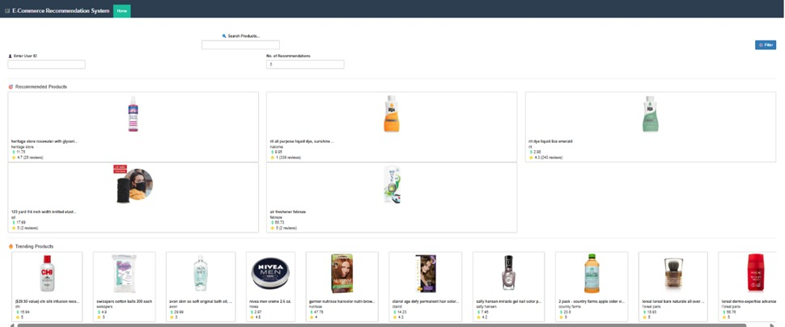
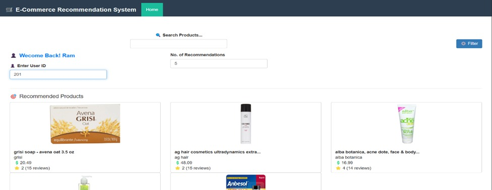
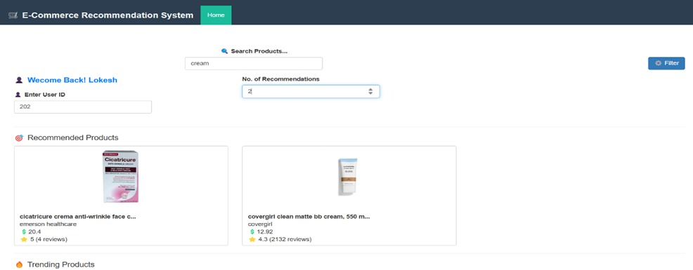
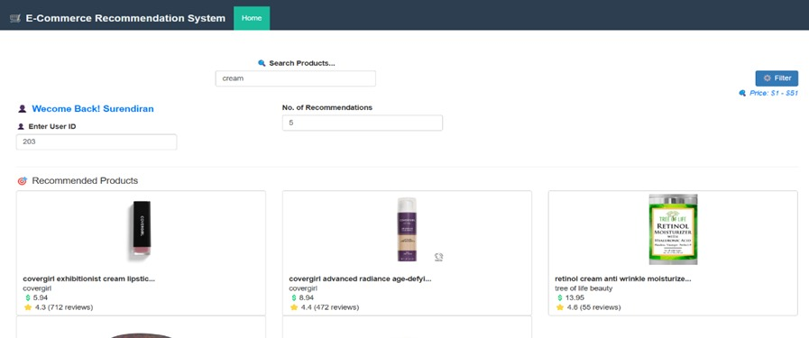
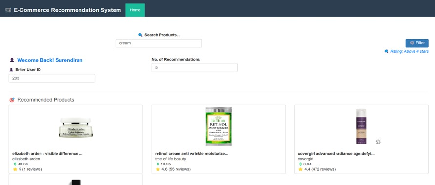
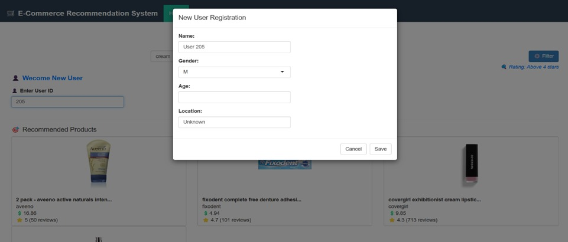
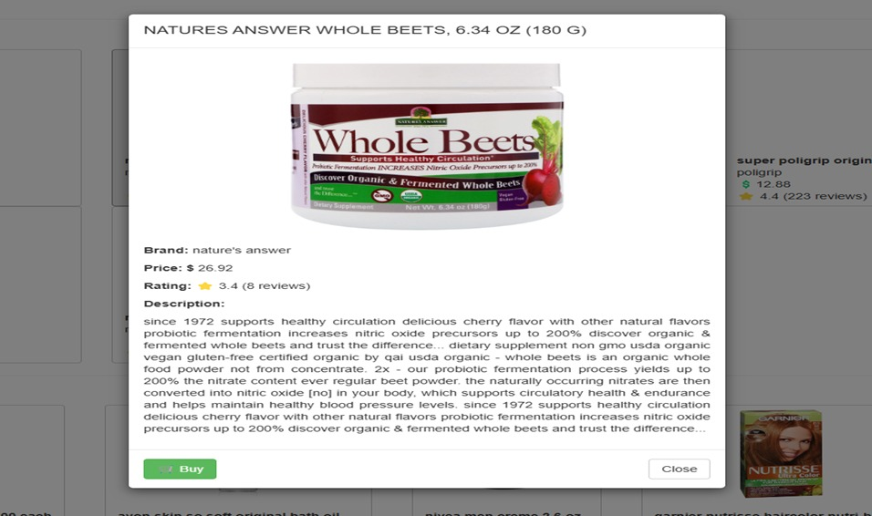
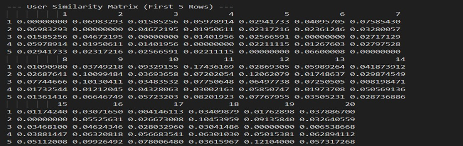
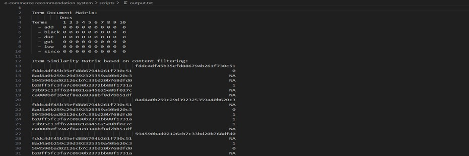
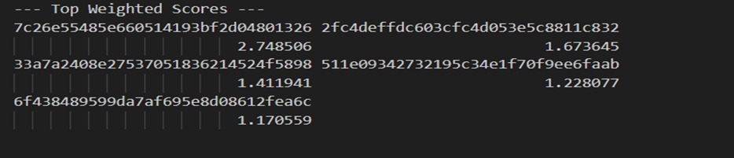

# 🛒 E-Commerce Recommendation System

An intelligent and interactive recommendation engine built using **R** and **MongoDB**, designed to suggest personalized product recommendations in an e-commerce setting.

---

## 📌 Overview

This project was developed as part of the Big Data Analytics course at **College of Engineering, Guindy (Anna University)**. The system delivers dynamic, personalized product recommendations using multiple filtering techniques and presents insights through an interactive **Shiny Dashboard**.

---

## 🔍 What It Does

Our system provides personalized product recommendations using:

- 🧠 **Collaborative Filtering**  
  Uses user-item interactions to recommend products based on similarities between users (User-based) or between items (Item-based).

- 📄 **Content-Based Filtering**  
  Leverages product metadata like descriptions, tags, and names to recommend products similar to what a user has liked or searched for.

- 🎯 **Constraint-Based Filtering**  
  Allows filtering recommendations by price range and minimum rating to align with user preferences.

- 🔗 **Hybrid Approach**  
  Combines collaborative and content-based filtering scores to enhance both diversity and accuracy of recommendations.

---

## 📊 Why It Matters

Recommendation systems are crucial in enhancing user experience across digital platforms — from suggesting the next movie on Netflix to recommending products on Amazon. In e-commerce, such systems:
- Improve **customer engagement**
- Increase **conversion rates**
- Drive **sales and retention**

With the global e-commerce recommendation engine market expanding rapidly, building smart, scalable recommendation systems is more relevant than ever.

---

## 📦 Dataset

We used the **Walmart E-Commerce Product Dataset** from **Kaggle**, containing:
- **Product metadata**: ID, name, brand, price, rating, description, image URLs
- **User profiles**: ID, age, gender, location
- **Interaction data**: user-product ratings and timestamps

This provided a rich, real-world foundation for experimenting with and optimizing our recommendation algorithms.

---

## 💡 Tech Stack

- 💻 **R Programming Language**  
  - `shiny`, `shinydashboard`: For interactive UI  
  - `recommenderlab`, `proxy`, `tm`: For recommendation logic and text processing  
  - `mongolite`, `dplyr`, `stringr`, `reshape2`: For database and data manipulation

- 🗃️ **MongoDB (NoSQL)**  
  Used to store users, product data, and interaction history.

- 🧪 **Shiny Dashboard**  
  A responsive web interface to explore recommendations, filter options, and visualize insights.

---

## 📈 Data Visualization

In addition to recommendation features, the dashboard includes **data visualizations** to help understand:
- Distribution of ratings
- Most popular products
- User activity patterns
- Price vs rating trends

---

## 🖼️ Screenshots

### 📌 Homepage

---

### 👤 User-Based Products Recommendation (UBCF)

---

### 🔗 Hybrid Recommendations (IBCF + Content-Based)

---

### 🎯 Usage of Filters

**(i) Price Filter –** Recommends products in ascending order of price  

**(ii) Rating Filter –** Recommends products in descending order of ratings  

---

### 🙋 Handling New Users (Data Entry in Database)

---

### 🛍️ Item Display & Dynamic User-Item Interaction (Buy Option)
*Interacted data stored in MongoDB*

---

### 📊 User Similarity Matrix

---

### 📚 Term-Document Matrix (TDM) & Item Similarity Matrix

---

### 🔢 Similarity Calculation & Top-N Product Selection

---

---

## 👥 Team

- **Surendiran M**  
- **Ram Prasath K V**  
- **Lokesh Kannan M**

---

## 📄 License

This project is for academic and learning purposes.

---

Feel free to explore, fork, and build on this system!
